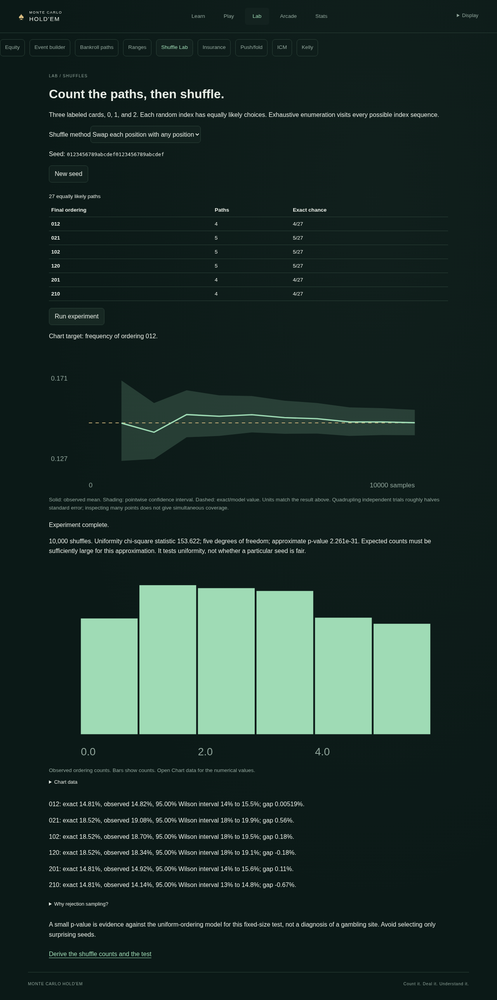
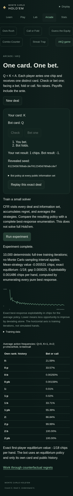
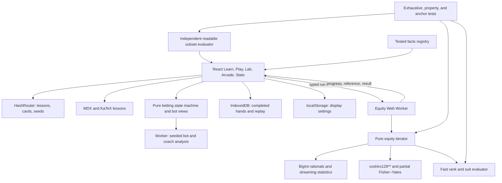

# Monte Carlo Hold'em

A static browser course, equity lab, and No-Limit Hold’em game. Learn probability through counted card examples and reproducible experiments, then play against bots with a coach that explains its assumptions. Simulations run locally in workers.

Phases 0–9 are implemented locally. Learn contains 53 lessons across chapters 0–25. Play supports heads-up and 6-max tables, including running all-ins twice. The Lab covers equity, ranges, repeated events, bankroll paths, shuffles, insurance, push/fold, ICM, and Kelly. Arcade includes five drills and a playable AKQ game with a small CFR trainer. Stats summarizes completed hands and forecasts.

**GitHub:** [Texas-Holdem](https://github.com/ZacharySF/Texas-Holdem). GitHub Pages is configured to use Actions; the included workflow deploys `dist/` after successful checks on `main`. Publication is pending the first successful deployment. Hash routes and relative assets support project Pages URLs and shared Lab links.

## Run it

```sh
nvm install
nvm use
npm ci
npm run dev
```

Open http://localhost:5173/ (or the local URL printed by Vite if that port is busy). Node 24.20.0 LTS is pinned in `.nvmrc`.

On NixOS without Node on PATH:

```sh
nix shell nixpkgs#nodejs_24 --command npm ci
nix shell nixpkgs#nodejs_24 --command npm run dev -- --host 127.0.0.1 --port 5173 --strictPort
```

Leave the terminal running while using the app; press Ctrl+C to stop it. Later starts only need the second command.

| Command                | Purpose                                                                     |
| ---------------------- | --------------------------------------------------------------------------- |
| `npm ci`               | Install the locked dependencies                                             |
| `npm run dev`          | Start Vite                                                                  |
| `npm test`             | Unit, property, exhaustive five-card, and equity tests                      |
| `npm run test:smoke`   | Production Playwright checks (build and install Chromium first)             |
| `npm run coverage`     | Same suite with enforced engine coverage thresholds                         |
| `npm run lint`         | ESLint and Prettier checks                                                  |
| `npm run typecheck`    | Strict TypeScript checks                                                    |
| `npm run build`        | Typecheck and production build                                              |
| `npm run bench`        | Evaluator and Monte Carlo throughput with machine details                   |
| `npm run verify:7card` | Exhaust all seven-card hands and compare one million hands to the reference |
| `npm run format`       | Apply Prettier                                                              |

## Use the Lab

1. Tap a card, choose its rank, then its suit. Used cards are disabled. Clear a card from the same picker.
2. Choose specific or random opponents. Add opponents for multiway equity. Add board cards to reduce the number of possible deals; dead cards are excluded from every deal.
3. Count exactly when the work fits the interactive budget, choose Auto, or simulate 1k through 1M deals. Cancel a running experiment immediately.
4. Read the reduced fraction, percentage, one-in-N frequency, and odds against for each result. Expand **All players** for opponents and **Why is this the equity?** for the computation.
5. Copy the link to preserve cards, seed, method, and sample count. Open it and press the same run button to reproduce the result. Editing the seed accepts 32 hexadecimal digits, excluding all zero.

Equity measures pot share: a tie divides the pot among all winners. A sampled fraction is the observed frequency, not the exact underlying probability. Every sample result shows its count and uncertainty. Binary win/tie/loss events use Wilson intervals; fractional pot shares use an approximate normal interval based on sample variance, with a boundary safeguard so an unvarying sample does not claim certainty. These are individual intervals, not a simultaneous guarantee over all chart updates. Exact results have zero sampling error; deterministic partial enumerations are shown as progress only.

For feasible setups, simulation also computes an exact reference and displays the gap. The SVG chart shows the running estimate, uncertainty band, and reference. Exact feasibility uses a conservative budget of 120,000 hand evaluations per request, accounting for random opponents as well as boards. It is intended to stay interactive on phones; the pure engine permits larger enumerations for verification.

Dark and light themes, an optional four-color deck, suit symbols, keyboard focus, reduced-motion handling, and phone-sized card controls are included. Display settings stay in localStorage. No accounts, backend, analytics, external fonts, or application-data network requests.

## Learn: chapters 0–25

Open Learn for the optional Hold’em introduction, probability and odds formats, ordered counting, combinations, complements, inclusion–exclusion, conditional card removal, final hand frequencies, flop events, and drawing odds. Every lesson has a concrete hook, a careful explanation, an aligned KaTeX notebook, a live experiment, five seeded practice questions with worked solutions, a table application, and a quant corner. Exact counting, simulation, shortcut error, and the decision it supports are connected in every lesson.

The lesson URL preserves its seed. Experiments show exact and observed values in all four formats, sample counts, a Wilson confidence interval, the gap, and an SVG convergence chart. Counting formulas are checked against dealt outcomes, suit textures against independent suit counts, and final hand categories against exhaustive evaluators. Selectable Phase 4 events cover every required anchor, including a million-trial option for rare royals. Rare nonzero percentages retain significant digits. KaTeX fonts and individually loaded MDX lesson files are local assets.

Practice accepts equivalent fractions, finite decimals, percentages, “1 in N,” and “N : 1” odds against. Solutions appear after answering. Four correct answers out of five establish mastery; completed best scores and attempt counts persist in localStorage. Chapters unlock in order, the introduction can be skipped explicitly, and every lesson can be opened manually. Unfinished answers reset when leaving or changing the seed, as stated in the UI.

## Arcade: five seeded drills and AKQ

Open Arcade, keep the 20-second clock, choose 40 seconds, or use untimed practice. Each seeded set presents five actual card spots with an explicit next-card target. Count flush, straight, combined, or exposed-opponent winning cards; no card counts twice. Pause and resume whenever needed. Expiry shows the worked answer and waits for you to advance.

Answers reveal the qualifying cards, the unseen-card count, the exact next-card chance in four formats, and a lesson link. A backdoor requiring two cards is distinct from a next-card out. Only completed sets save a best score; improving that score earns drill XP in Play. Replay or share the URL seed without duplicating XP for the same answers. Display settings and reduced-motion behavior carry across modes.

The drawing lessons explicitly distinguish a rank-hit set-mining event from every possible full house, a made flush from an exact flush draw, fixed-out hit odds from showdown equity, and clean turn cards from guaranteed river winners. The coach links to these definitions.

## Play: heads-up and 6-max

1. Select two or six seats, an available bot persona, and a blind level. Commit the next deal to display its SHA-256 hash, then press **Deal committed hand**. Your seed stays hidden in the interface until the hand ends.
2. Check, call, fold, or raise to a total contribution for the current round. Legal controls enforce the minimum increment, stack caps, and short-all-in restrictions. The button rotates between hands.
3. Toggle the coach for weighted-range equity, separate win/tie/loss estimates, pot odds, highlighted category-improvement cards, and direct EV comparisons. Exam mode asks for your equity estimate before revealing the coach.
4. Review the decision grade after acting. The model ignores future betting, depends on a heuristic range estimate, and uses your displayed fold-response assumption for a raise. Known uncallable overbets are excluded when pricing a short-stack call. The highlighted cards improve a made-hand category; they are not guaranteed winners.
5. After the hand, inspect all hands and every bot reason, verify the revealed seed, replay the recorded actions, or run any encountered street out 10,000 times. Outcome histograms show net chip awards after each main and side pot is settled with the final matched contributions held fixed.

Completed hand histories, commitments, actions, estimates, and exam guesses live in IndexedDB. The play-money profile lives in localStorage. Hand/decision XP, mastered-lesson XP, and Outs Rush best-score XP unlock stakes and the tight-passive, loose-aggressive, calling-station, and equity-driven personas. The bankroll can be explicitly refilled after busting; it has no cash value. Unfinished hands remain session-only and are abandoned without settlement on leaving Play or reloading.

Bots receive only their own cards, the board, public actions/stacks/contributions, position, and legal options. Their workers never receive the opponent's cards, undealt deck, or deal seed. Ranges are reproducible heuristics rather than fitted behavioral models. SHA-256 commitments verify local consistency; a static browser game does not provide an independent adversarial fairness authority.

## New Lab tools and Stats

**Event builder** composes a supported card event with exactly or at least a selected number of successes across independent hands. Its exact binomial answer uses the counted base event; its worker deals the cards again to check it. Share the URL to preserve parameters and seed.

**Ranges** provides a scrollable 13×13 grid with phone-sized targets, relative combo weights, presets, blocker counts, specific-hand equity, and a cancellable class-equity heatmap against random cards or the selected range. Each cell reports samples, an interval, and an exact reference when feasible. The distribution chart gives each class one count; it is not an overall combo-weighted equity. Suit-specific differences can be explored with specified cards.

**Bankroll paths** takes win rate, SD, hand count, starting bankroll, and path count. It shows final results, maximum drawdowns, time below a previous peak, and ruin frequency with uncertainty. Independent normal 100-hand increments are an approximation: ruin is checked at block endpoints, and the model excludes within-block losses, changing strategies, and uncertainty in its inputs.

**Stats** reads completed histories from this device. It reports hands, actual bb/100 with an approximate confidence interval, a sample-size planning calculation, actual versus all-in-EV-adjusted results, decision grades by concept, and forecast calibration over time. All-in adjustment settles each eligible side pot separately from its fixed commitment point; pots that never qualify retain actual results. Sampling error in an adjusted award is displayed separately from uncertainty in poker results. This line does not measure decision quality or remove luck before commitment.

## Chapters 9–19 and the new drills

The new lessons derive hypergeometric counts, repeated trials and waiting times, preflop matchup equity, EV with rake, multi-street trees, variance, LLN/CLT, interval coverage and hypothesis tests, Monte Carlo error, ranges, and Bayesian updating. They introduce e and summation notation before using them. Experiments include controlled outcome distributions, selectable sample sizes, exact references, and visible model limits. Negative exact answers are accepted for chip EV problems.

**Call or Fold** grades direct EV with a displayed fixed rake and supplied equity. **Guess the Equity** records a forecast before enumerating every river against an exposed hand; it reports exact-equity error and a Brier score against a seeded binary pot-unit outcome. **Combo Counter** counts remaining physical hands after blockers. All three provide five seeded questions, optional clocks, pause/resume, and worked solutions. Only complete sets persist. Their first completed answers per seed are retained so replay cannot inflate XP or overwrite calibration after seeing the outcome.

The six-player coach reports separate pot awards under an explicit all-opponents-call/no-future-betting model. It refreshes estimates when the raise size changes. Whole-table equity is shown as context, not multiplied indiscriminately by side pots. Later folds, changing ranges, and strategic responses can change these conditional values.

## Randomness, tournament math, and the capstone

**Shuffle Lab** exhausts every three-card index-choice path, contrasts naive swaps with Fisher–Yates, and checks sampled ordering counts against exact frequencies. It reports the chi-square statistic and its approximate tail probability, with the null hypothesis and assumptions visible. A finite-source example shows exactly why rejection removes modulo bias.

**Streak Trap** gives five seeded predictions about independent next outcomes, then shows the full conditional-probability solution. Its experiment counts overlapping runs across a complete observation window. Completed scores persist; changing opponents or probabilities is explicitly outside the independence premise.

**Running twice** is selected before committing a deal. Both boards retain exposed cards and draw their remaining cards without replacement. Main and side pots preserve eligibility, combine both fractional awards, and round once. Fractional equity is unchanged; integer-chip rounding can change individual expectations slightly. The river experiment measures covariance and shows why an independence assumption changes the variance. Stats uses the actual paired-board settlement rule when adjusting such a hand. History run-it-out remains a labeled one-board comparison.

**Insurance** prices a defined outright-loss benefit and seller loading. **Push/fold** prices supplied fold probability and called-range equity, alongside a separately verified three-rank Nash example. **ICM** enumerates proportional finishing orders, conserves prizes, and computes bubble factor from equal chip swings. **Kelly** introduces logarithms, plots expected growth, and compares fractional sizing with a separate fixed-unit ruin model. Assumptions and lesson links sit beside the controls; these calculators do not claim to solve unrestricted Hold’em or predict an opponent's range.

**AKQ** deals distinct Q, K, A cards in a one-bet ante game. Play against an information-limited equilibrium bot, reveal the policy and seed, and replay the same deal. The CFR worker trains an average policy; its convergence plot uses exact legal best responses, not self-play payoff alone. It enumerates the full toy game, so no Monte Carlo interval applies to its exploitability metric. Chapters 20–25 connect all these tools to computed notebooks and practice.





### Browser checks

```sh
npm run build
npx playwright install chromium
npm run test:smoke
```

On NixOS, point `PLAYWRIGHT_CHROMIUM_EXECUTABLE_PATH` at the installed Chromium executable instead of downloading a browser. The suite starts a production preview on port 4174, checks desktop and phone layouts, exercises all final lesson workers and mastery, calculator edits, replay, two-board settlement, Stats, cancellation, keyboard focus, tap targets, and display persistence. Screenshots are regenerated by the suite. Test traces and reports are ignored by Git.

## Architecture



The engine has no DOM or React dependency. Cards are rank-major integers; larger encoded hand strengths win. The fast evaluator uses rank counts and suit masks with no bundled lookup tables. The reference evaluator sorts groups in every five-card subset and reports the best five, category, and English name. The worker schedules pure iterator batches and posts progress about every 50 ms. Terminating its worker cancels a run and prevents stale updates. Weighted integer combo ranges extend `PlayerInput`. Exact range equity accumulates BigInt weighted pot shares; sampled range equity rejects entire colliding joint assignments to preserve the intended conditioned distribution. Pathologically overlapping inputs fail explicitly rather than silently biasing samples. The range editor expands its 169 classes into those weighted physical combos.

See [architecture decisions](docs/ARCHITECTURE.md), [product specification](docs/SPEC.md), [roadmap](docs/ROADMAP.md), [curriculum](docs/CURRICULUM.md), and [working rules](AGENTS.md).

## Correctness evidence

- Every one of the 2,598,960 five-card hands is evaluated by both paths. Tests check every category count, all 7,462 distinct strengths, and the royal count.
- The default suite compares 100,000 seeded seven-card hands, checks card-order invariance with fast-check, and covers wheels, kickers, counterfeits, board plays, and split pots.
- AA versus KK is enumerated over all 1,712,304 boards; a fixed-seed 200,000-trial estimate must be within four standard errors of the exact equity.
- Exact multiway ties, random opponents, dead-card removal, pot-share conservation, malformed inputs, reproducibility, and incremental progress are tested.
- PRNG tests include a known-output vector, rejection-sampling bounds, and a four-card shuffle chi-square check with a fixed seed and significance level 0.001.
- Counting facts and fraction conversions have unit tests. Phase 8–9 anchors cover exhaustive shuffle bias, bluff break-even/MDF, polarized betting ranges, prize conservation, toy-game best responses, and covariance-aware two-board awards.
- `verify:7card` has been run successfully: all 133,784,560 seven-card hands matched category totals, including 4,324 royals; one million seeded hands matched the independent reference. The final audit reran both named checks on 2026-09-27: 19.607 seconds for exhaustive enumeration and 13.850 seconds for the reference comparisons. [ROADMAP](docs/ROADMAP.md#final-audit-exhaustive-seven-card-results) records every observed category beside its anchor.
- A Chromium interaction review passed at desktop and 375px phone widths: URL replay, worker results/cancellation, used-card blocking, custom seeds, exact reference, settings persistence, and routes; no browser errors or phone horizontal overflow. The permanent production Playwright suite now runs in CI on desktop and a 375px phone viewport.
- Game tests exercise heads-up action order, minimum/full/short raises, uncalled returns, side pots, odd chips, all-in runouts, replay, and hidden-information isolation. A fixed-seed fast-check property verifies chip conservation, nonnegative stacks, contribution totals, and deterministic replay across 1,000 generated legal hands.
- Weighted exact equity and sampled equity are compared on controlled ranges, including blocker removal, joint collisions, random opponents, and multiway ties. The pot-odds anchor (pot 100, opponent bets 50, call 50) gives break-even equity 1/4 and zero direct call EV at that equity.
- Fifty-three MDX lessons render with the seven-part contract and valid formulas; hundreds of seeded practice variants are checked. Tests cover answer normalization, delayed solutions, completed-set scoring, mastery/unlocks, corrupt progress data, SHA-256 verification, and IndexedDB round trips.
- A production Chromium review passed at 375px: all ten lessons, seeded simulation replay, 80% mastery and reload, unlocking, pre-deal commitment, hidden bot cards, exam gating, a full hand to showdown, hash verification, action replay, turn runouts, saved-history reload, and no horizontal overflow or browser errors.
- Phase 4 tests cover every drawing anchor, independent suit-texture counts, probability-tree conservation, clean/dirty and overlapping outs, rare-event simulations, and seeded drill answers. The 375px production review passed all nine new lessons, expanded notebooks, simulation selection/replay, mastery reload, a full Outs Rush set, persisted scores, pause/resume, light/four-color display, and Play XP/coach links with no page errors or overflow. Timer expiry and replay without duplicate XP also have component tests.
- CI enforces at least 90% engine statements, branches, functions, and lines. The expanded suite tests engine distributions, seeded drills, all 53 lesson contracts, and six-seat pot accounting. Validation passed 90 tests across 18 files, lint, strict typecheck, production build, and 10 permanent Playwright tests. Engine coverage is 99.22% statements, 98.24% branches, 100% functions, and 99.31% lines; the same coverage floor remains enforced.

The [anchor-to-test index](docs/ROADMAP.md#final-audit-anchor-to-test-index) maps every roadmap anchor to its test file and exact name. The audit replaced approximate checks for exact probabilities, ICM prize totals, and two-river moments with rational equality; it also asserts sample counts and mastery boundaries explicitly. Regression tests reject machine-specific paths, literal percentage labels in presentation code, stale test references, and CI configurations that omit their own Chromium installation. Lesson examples and shared confidence labels now read their values from the same code that computes the experiment. No engine algorithm changed in this audit; the measured benchmark results below remain the Phase 9 measurements.

## Benchmarks

Measured 2026-09-27 with Node v24.20.0 on an Intel Core Ultra 7 256V, 8 logical CPUs, 15.2 GiB RAM, Linux 7.2.5, x64. One process and one worker-equivalent execution thread; results vary by machine and runtime.

| Workload                                        |              Throughput |
| ----------------------------------------------- | ----------------------: |
| Fast seven-card evaluation                      |  4,650,931 hands/second |
| Monte Carlo, AA versus one random opponent      |   917,822 trials/second |
| Monte Carlo, weighted persona range             |   195,541 trials/second |
| Lesson experiment, seven-card one pair          | 2,810,444 trials/second |
| Six-seat side-pot awards, five random opponents |   114,073 trials/second |

`npm run bench` warms the evaluator with 10,000 seeded hands, then measures one million evaluations, 100,000 random-opponent Monte Carlo trials, 10,000 weighted-range trials, 100,000 seven-card category lesson trials, and 10,000 six-seat side-pot trials. Hand generation is outside the evaluator timer; Monte Carlo includes dealing, evaluating both players, statistics, and snapshot construction. The timing excludes worker messaging and UI rendering. Seed: `0123456789abcdef0123456789abcdef`. The script prints hardware details and a checksum so the work remains observable.

The Phase 7 baseline was 4,647,845 evaluations/s, 938,968 random-opponent trials/s, 188,605 weighted-range trials/s, 2,780,098 lesson trials/s, and 67,605 six-seat payout trials/s. The performance pass builds one used-card set per accepted joint deal instead of repeatedly flattening exclusions for each candidate card. The final six-seat rate is 114,073 trials/s (about 69% above that baseline); an earlier run in this delivery measured 120,050. These single-run timings are not a controlled statistical benchmark. Evaluator/equity algorithms are unchanged, and their timing differences should not be credited to the payout optimization. The two-river experiment also replaces full-deck shuffling with two distinct bounded index draws.

## Randomness and replay

The documented [xoshiro128** algorithm](https://prng.di.unimi.it/xoshiro128starstar.c) consumes a nonzero 128-bit state encoded as four eight-digit hexadecimal words. Fresh seeds come from `crypto.getRandomValues` outside the engine. Bounded integers reject the incomplete upper interval before reducing modulo the bound; this removes modulo bias. Fisher–Yates deals without replacement. Each trial restarts from the available deck, so trials sample the same experiment independently through the PRNG sequence.

The seed and inputs reproduce the same results for this algorithm version. This is not a cryptographic PRNG. Play commits the UTF-8 hexadecimal seed text with Web Crypto SHA-256 before dealing and reveals it afterward. Separately labeled SHA-256 derivations supply analysis/runout seeds, so their displayed values do not reveal the deal seed. Hand replay includes the recorded actions, burn cards, and board sequence.

## License

[MIT](LICENSE), copyright Zachary Finley-Stubbs.
