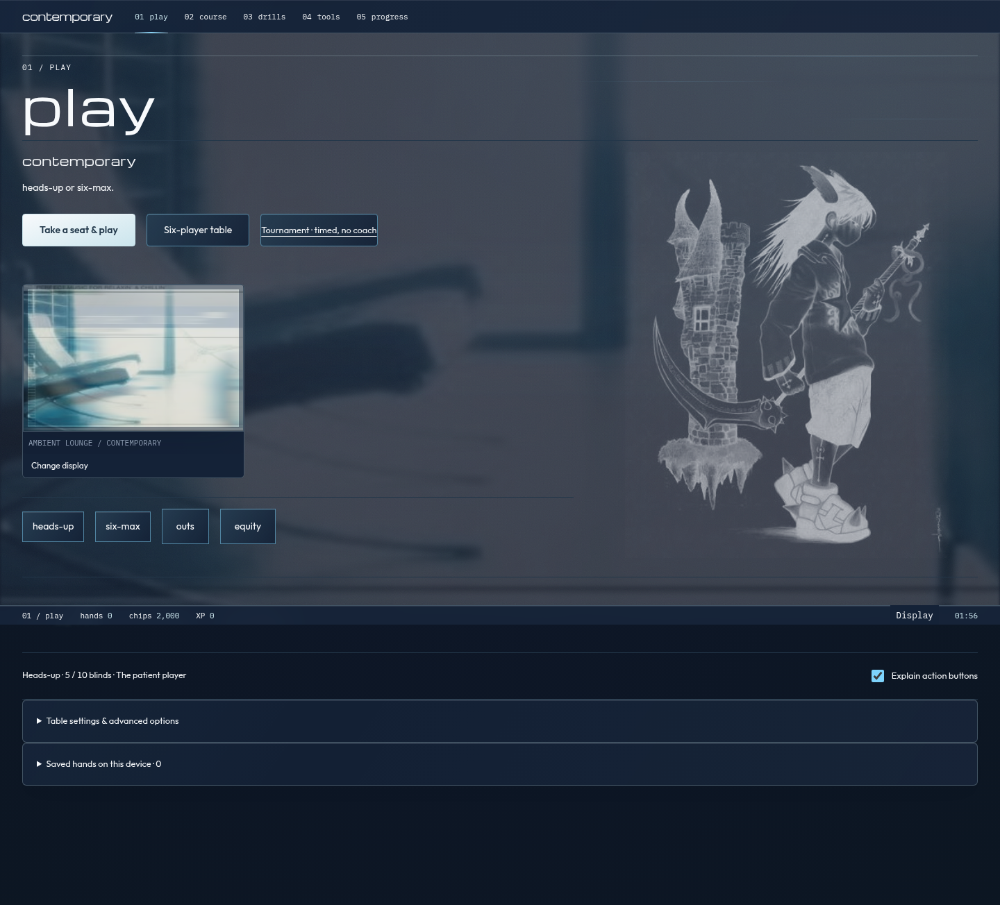
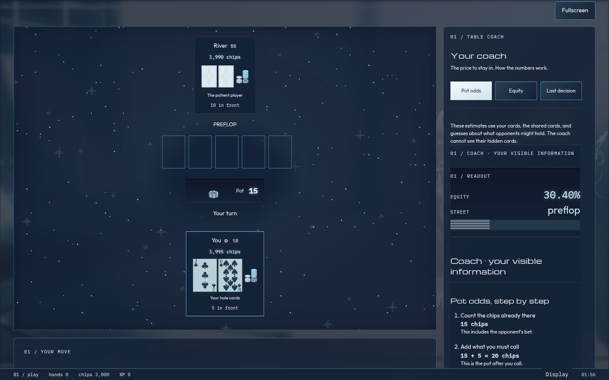
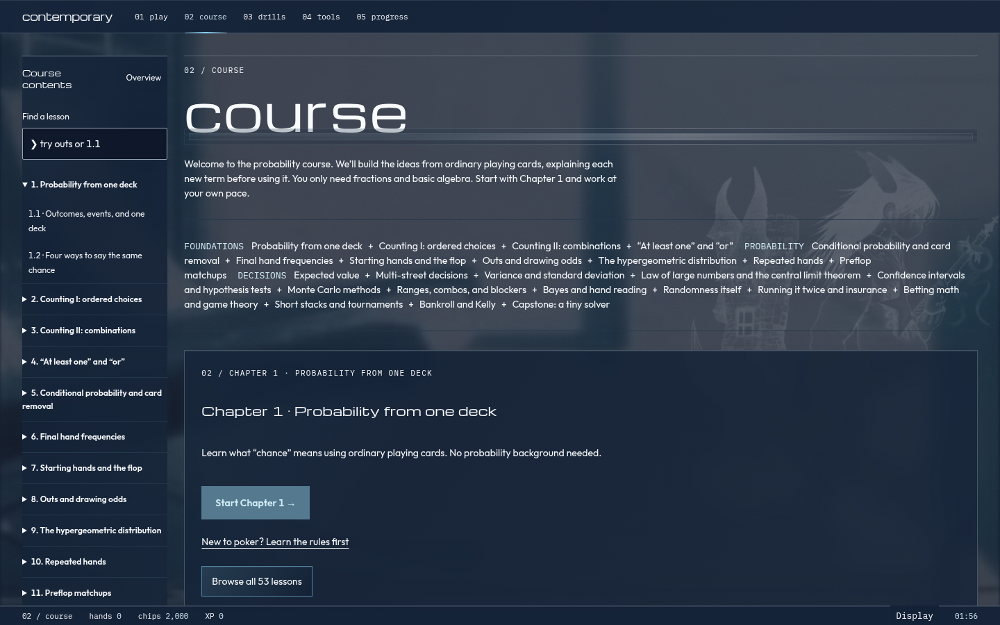

# contemporary

A little poker room for learning probability. Play a hand, work out the price of a call, then see where the numbers came from. Cool glass, airport-lounge artwork, and a table full of stars. The math gets room to breathe.

[Open the poker room](https://zacharysf.github.io/contemprorary/) · [Browse the course](https://zacharysf.github.io/contemprorary/#/learn)



## Take a seat

Choose heads-up or six-max. Blinds come out of the stacks, bets go into the pot, and the chip piles update beside each player's cards. You see your cards; the bots see theirs. Nobody's decision model gets another player's hidden hand.

The coach sits beside practice play on a wide screen. On a phone, open it when you want help. Pot odds explains the call cost and each pot you can actually win. Equity shows how wins and split pots become an estimate. Last decision keeps the action, street, and estimate from the moment you acted. If analysis hadn't finished, the move stays ungraded.

Press F while playing to enter or leave fullscreen. Escape also exits. The hand keeps running, the stars stay inside the table, and typing into an input won't trigger the shortcut.



## Follow the numbers

The course has 53 lessons across chapters 0–25. It starts with the rules and fractions, then builds toward combinations, outs, conditional probability, expected value, ranges, inference, and game theory. Definitions come before notation. Worked examples take one step at a time, and reading checks let you think before opening the answer.

Lesson 12.2 goes through pot odds in detail: why side pots exist, who can win each one, what an expected award means, and why you subtract the new call once to get net value. It also separates chip value from tournament prize value.

Drills give you short practice sets. Tools let you change a range, enumerate a runout, compare a simulation with an exact answer, or explore bankrolls, ICM, and Kelly. Progress keeps completed hands and learning results on your device.



[Full curriculum](docs/CURRICULUM.md) · [Math and test audit](docs/MATH_AUDIT.md) · [More desktop and phone screenshots](docs/screenshots/release/README.md)

## A few things to know

- Bots choose the highest estimated chip return among the legal actions they sample. Their ranges and calling behavior are assumptions. This is not a solved GTO opponent, and sampling can pick the wrong move.
- The coach uses your visible information and estimated opponent ranges. Direct-odds comparisons don't predict every later bet or re-raise. Small differences can be sampling noise.
- Tournament mode is a six-player freezeout with 2,000 chips each, a 30-second decision clock, rising blinds, and no coach. Its house rules appear before entry. It's a local single-table exercise, not a simulation of every live tournament procedure.
- Leaving or reloading abandons an active practice hand and forfeits a tournament. Completed practice histories and learning progress persist; unfinished hands and quizzes don't resume.
- Cards remain hidden during live decisions. Contested showdowns reveal the relevant hands. After a hand, an explicit study option can reveal hidden hands; that information never feeds back into bot decisions.
- Everything runs in your browser. There's no account, multiplayer server, or real-money betting.

Click the lounge photo to change the display. Violet, Blue, Grey, Dark, Darker, Green, Purple, Amber, and Ocean are available, along with Surprise me. Four-color mode makes clubs green and diamonds blue; the preview shows the change immediately. Done, Escape, or a click outside closes the menu. Reduced-motion settings stop the parallax and drifting stars.

## Run it locally

Use Node 24. From this directory:

```sh
npm ci
npm run dev
```

Open the URL Vite prints. The app uses hash routes so it also works on GitHub Pages:

| Section         | Route               |
| --------------- | ------------------- |
| Play            | `#/play`            |
| Tournament      | `#/play/tournament` |
| Course          | `#/learn`           |
| Pot-odds lesson | `#/learn/12-2`      |
| Drills          | `#/arcade`          |
| Tools           | `#/lab`             |
| Progress        | `#/stats`           |

It's Svelte 5, TypeScript, and Vite. Lessons are Svelte Markdown compiled with mdsvex. Poker calculations live in a pure TypeScript engine; workers keep the heavier experiments off the UI thread. There's no React runtime or JSX source.

## Check it

```sh
npm run coverage
npm run typecheck
npm run lint
npm run build
npx playwright install chromium
npm run test:smoke
node scripts/contrast-check.mjs
npm run verify:7card
```

The September 30, 2026 audit passed 119 unit tests and 82 Chromium browser checks across desktop and phone layouts. Engine coverage was 99.22% statements, 98.47% branches, 100% functions, and 99.34% lines. Typecheck, lint, build, and contrast checks passed too.

The slow verifier counted all 133,784,560 seven-card combinations and compared another million seeded hands with the independent reference evaluator. The regular suite also exhausts all 2,598,960 five-card hands. These are checks of the implemented calculations, not a claim that all poker strategy has been solved. The [audit](docs/MATH_AUDIT.md) maps the course to its tests and records the limits.

Pushes to main run GitHub Actions checks and deploy Pages after they pass. CI runs coverage and browser tests; the slower seven-card verifier is a separate local command. [Recorded benchmarks](docs/BENCHMARKS.md) include their dates and hardware; they were not rerun for this documentation update.

## Under the hood

The seeded `xoshiro128**` generator makes experiments reproducible. Bounded draws use rejection sampling; deals use Fisher–Yates without replacement. New seeds come from browser crypto outside the engine. This is reproducible randomness, not a cryptographic game server.

Practice commits a SHA-256 hash before dealing and reveals the seed afterward. Saved hands include actions for replay. Analysis uses separate derived seeds. This helps inspect a local hand; it isn't protection against someone controlling their own browser.

[Architecture](docs/ARCHITECTURE.md) · [Roadmap](docs/ROADMAP.md) · [Working agreement](AGENTS.md)

## Credits

Code is [MIT licensed](LICENSE), copyright Zachary Finley-Stubbs. Playing cards are adapted from Byron Knoll's public-domain Vector Playing Cards; see the [card credits](public/cards/LICENSE.md). Fonts are self-hosted, with license files alongside the assets.

The lounge collage and character drawing were supplied as visual references. Their original artists weren't identified; they are not claimed as project-original or public-domain artwork. [Artwork notes](public/art/lounge/README.md).

The displayed name is contemporary. The GitHub repository and Pages URL keep the spelling `contemprorary`.
